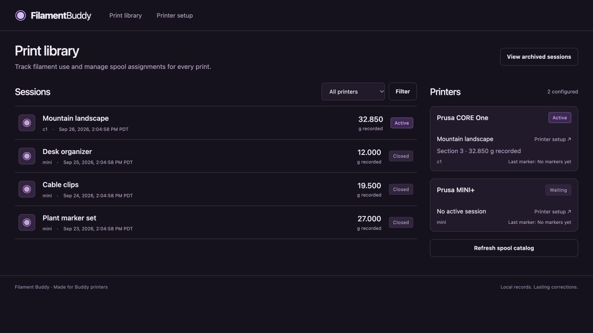
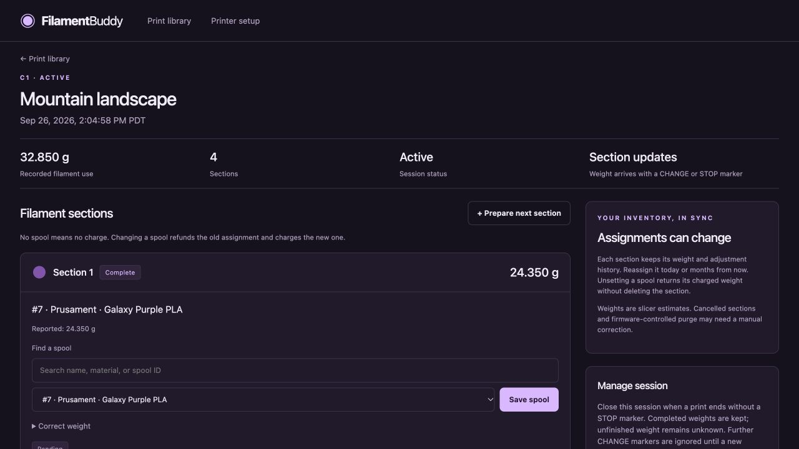

# Filament Buddy

Every color accounted for. Filament Buddy records a print as ordered sections,
then applies each section's weight to the Spoolman spool you choose. Change your
mind a month later: the old spool is refunded and the new spool is charged.
Select **No spool** to undo a charge without losing the weight or history.

A sibling to [Snapshot Buddy](https://github.com/nebhale/snapshot-buddy), built
with Go, SQLite, and a purple, responsive web interface. Runs on 64-bit Raspberry
Pi and x86 Linux, without a cloud service or software on the printer.

- Multiple Buddy-firmware printers; sequential, single-nozzle M600 color swaps.
- Automatically opened sessions and numbered sections, with recovery and manual close.
- Prepare future spool assignments after a session starts.
- Correct any observed section's weight while retaining the slicer's original value.
- Persistent adjustment ledger, offline queue, and explicit ambiguous-request recovery.
- Archived, editable history; no automatic deletion or retention limit.
- Non-root ARM64/AMD64 images, YAML configuration, optional Basic authentication.





## Quick start

Prerequisites: Docker, Spoolman, a Buddy-firmware printer with `gcode` metrics,
and PrusaSlicer (generated snippets tested with 2.9.6). Download the Compose and
configuration examples from the [v1.0.0 source](https://github.com/nebhale/filament-buddy/tree/v1.0.0),
or clone the repository and check out `v1.0.0`.

```sh
cp config.example.yaml config.yaml
```

Set `metrics.advertised_host` to dockerpi's LAN address and `spoolman.url` to an
address reachable **inside the container**. For a host-published Spoolman port,
use `http://host.docker.internal:<port>`. For a shared existing Docker network,
use the Spoolman service's hostname/port and add `-f compose.network.yaml` to
Compose commands (`SPOOLMAN_NETWORK` overrides the network name).

Configure the metrics relay described below, then prepare storage and start
Filament Buddy:

```sh
mkdir -p data
sudo chown 10001:10001 data
docker compose pull
docker compose up -d
```

For named-volume storage, omit directory preparation and use:

```sh
docker compose -f compose.yaml -f compose.volume.yaml up -d
```

Open `http://<dockerpi-ip>:8081/setup`, copy the generated snippets into your
printer preset, and approve the metrics destination on the printer if prompted.

The Compose example uses the published `1.0.0` image. For upgrades, back up the
installation, set `FILAMENT_BUDDY_VERSION` to the new exact version, then run
`docker compose pull` and `docker compose up -d`. Releases are available after
their **Publish containers** workflow completes. No workflow deploys an
installation automatically.

### Shared metrics with Snapshot Buddy

The printer has one metrics destination. A separate samplicator instance copies
whole datagrams to both apps:

```text
printer → dockerpi:8514 → samplicator
                         ├→ 127.0.0.1:18514 → Snapshot Buddy UDP 8514
                         └→ 127.0.0.1:18515 → Filament Buddy UDP 8514
```

The default Compose file exposes Filament Buddy's UDP consumer only on loopback
port 18515. Manage the relay separately from the applications and configure its
destinations as shown above.
Filter the original printer's reserved IP **at the relay**. The application
usually observes its Docker network gateway as sender; leave `source_ip` unset
until verified, or configure that observed address. Different Docker networks
can have different gateway addresses.

All slicer `M334` commands must target the same relay LAN address and port.
Both Buddy apps support `metrics.advertised_port` independently of the listening
port. Existing Snapshot Buddy blocks stay in place. Without a relay, explicitly
change the Compose UDP mapping to expose a LAN port and advertise that port;
one direct destination cannot feed both applications.

### Slicer fields

Both Buddy apps use readable `START` and `STOP` markers. Filament Buddy uses
`CHANGE` for color boundaries; Snapshot Buddy uses `LAYER` for snapshots.

The setup page generates labeled BEGIN/END blocks:

1. Append the START block to **Start G-code**.
2. Insert the STOP block at the beginning of **End G-code**.
3. Insert the CHANGE block immediately before the existing `M600` in
   **Color change G-code**. Keep `M600` and other existing commands.

START, CHANGE, and STOP each send three identical markers separated by
1.1 seconds. This spreads retries beyond the firmware's one-second metrics
batching interval; shorter delays can put every copy in one UDP packet.
Metrics are enabled only during these blocks. `M400` precedes change/end
boundaries. This improves delivery but UDP remains lossy, and no acknowledgment
is available. Copy updated blocks and re-slice for changes to take effect.

The slicer maintains a global section number and rounded cumulative milligrams.
Each boundary reports the **preceding section's own weight**, so a lost marker
does not charge multiple colors to one spool. The firmware metric limit is
47 bytes; numeric markers fit it with 1–9 character printer IDs, up to 9,999
sections, and up to 999,999.999 g per section. A short ASCII filename is used as
the session name; long or non-simple names use `Print` plus the session's displayed
timestamp. This avoids losing a START to firmware truncation. Names do not
identify print runs: each session receives a unique generated ID.

Set filament density correctly in PrusaSlicer. Reported grams remain unchanged
when assigned to a different Spoolman filament. Values estimate slicer-accounted
extrusion; firmware-controlled purging, load/unload, runout changes, and unreported
custom extrusion may require a manual weight correction. MMU/tool switching and
layer checkpoints are outside this version.

## Sessions and sections

START opens Section 1 and closes an unfinished prior session as `superseded`.
CHANGE completes its numbered section and opens the next. STOP completes the
final section and closes the session. A loose CHANGE opens a recovered session,
retaining its completed section and marking earlier gaps unknown. A loose STOP
is diagnostic only. A later START opens a new session; it does not merge with
an earlier recovered session.

You cannot start a session from the web interface. After one starts, prepare
future numbered sections and choose their spools. Reorder or remove future
sections; observed sections keep their identity. Prepared rows not reached before
closure remain `unreached` and never charge a spool.

Active sections have unknown weight until the next boundary. Manual close retains
completed sections and marks the unfinished section incomplete. You can supply
its weight manually. After manual closure, color changes are ignored until a
new START or service restart. There is no idle timeout. Active sessions and
adjustment plans survive restarts.

Repeated START/STOP markers are deduplicated for five seconds across restarts;
CHANGE bursts use two seconds, and completed section numbers deduplicate for the
active session's lifetime. Out-of-order section markers can fill earlier gaps
without moving the current section backward. Conflicting weights are recorded
as diagnostics. Delayed packets beyond a closed session's duplicate window cannot
be reliably associated with their original print; inspect recovered sessions.

All timestamps are stored in UTC and displayed in the browser's locale/time zone.

## Corrections and synchronization

Selecting a spool charges its section's effective weight. Reassigning refunds
the original spool before charging the replacement. **No spool** returns all
previously charged weight, and the section can be assigned again later. An
override replaces the effective weight; clearing the override restores the
reported value (or unknown, if no report exists).

Changes and adjustment plans commit together in SQLite. The worker sends signed
`PUT /api/v1/spool/{id}/use` deltas, never overwriting Spoolman's total. Unrelated
consumption is preserved. Pending assignments can change while Spoolman is down;
unsent adjustments are superseded by the latest desired assignment.

Each section displays:

- **Awaiting weight / unassigned:** nothing to charge yet.
- **Pending / inflight:** an adjustment is queued or being sent.
- **Synced:** confirmed adjustments match the current assignment and weight.
- **Conflict:** a missing spool, rejected request, or refund exceeding recorded
  used weight requires correction. Recheck after addressing the discrepancy.
- **Uncertain:** a request may have reached Spoolman, but confirmation was lost
  or the returned balance was unexpected. Inspect Spoolman and intervening
  changes, then select **It was applied** or **It was not applied**.

Spoolman has no usage idempotency key and clamps used weight at zero. A timeout
or crash after dispatch cannot be retried safely without determining the outcome.
The app retains the exact spool, delta, pre-request balance, and history for
reconciliation; it blocks further writes to that spool while uncertainty or a
conflict remains. A simultaneous external edit may also require reconciliation.
Remote spool transfers are not atomic; each refund/charge is recorded separately.
Spoolman's usage endpoint updates its usage timestamps when corrections occur.

Catalog refresh runs every minute; cached labels remain available offline and
archived spools remain selectable. Deleted spool IDs remain visible historically
but cannot receive adjustments. Do not reuse a Spoolman ID for a different physical
spool or point an existing ledger at an unrelated Spoolman database.

Archiving is available on closed sessions. It only hides the session from the
main library: charges, corrections, history, and restoration remain available.
Spool assignments never change physical spool locations. FilaBridge's old history
is not imported. Disable competing consumption tracking for these prints before
using Filament Buddy, or both applications will charge them.

## Configuration and storage

Unknown YAML fields, invalid addresses, duplicate printer IDs, and unsupported
schema versions fail startup. Configuration is read at startup; restart to apply
changes. Printer IDs remain stable to preserve historical associations.

| Setting | Default |
| --- | --- |
| `http.address` | `:8080` (host port 8081 in Compose) |
| `metrics.address` | `:8514` |
| `metrics.advertised_host` | Required LAN IP |
| `metrics.advertised_port` | Listening port |
| `spoolman.url` | Required HTTP(S) base URL |
| `spoolman.timeout` | `5s`, allowed 100ms–1m |
| `data_dir` | `/data`, overridden by `FILAMENT_BUDDY_DATA_DIR` |
| `printers[].source_ip` | Optional observed-sender guard |

Set both `FILAMENT_BUDDY_AUTH_USER` and `FILAMENT_BUDDY_AUTH_PASSWORD` to require
Basic authentication. With neither set, the interface is open on the trusted
LAN. Use HTTPS for remote access. `/healthz` reports local service/database health
without authentication; an offline Spoolman does not make marker capture unhealthy.
Forms are CSRF-protected, and stale edits return a conflict instead of overwriting
newer section information. Upstream Basic credentials can be included in the
private Spoolman URL; they are not sent to the browser or included in errors.

All durable data lives in `/data/filament-buddy.db` and its SQLite WAL files.
Only one process may own a data directory. Nothing is automatically removed.
Stop the service and back up the entire data directory, YAML, Compose files,
and separately managed credentials. Restore into an empty stopped installation;
keep ownership UID/GID 10001. Back up Spoolman at the same maintenance boundary:
restoring only one side to an older state can replay or omit already-applied
adjustments. Inspect outstanding requests before resuming a restored installation.

```sh
docker compose run --rm filament-buddy -check-config
docker compose logs -f
```

Development and release instructions are in [CONTRIBUTING.md](CONTRIBUTING.md).
For help, bugs, and feature requests, use [Issues](https://github.com/nebhale/filament-buddy/issues).
See [SECURITY.md](SECURITY.md) for private vulnerability reporting.
Licensed under Apache-2.0; see [THIRD_PARTY.md](THIRD_PARTY.md).
